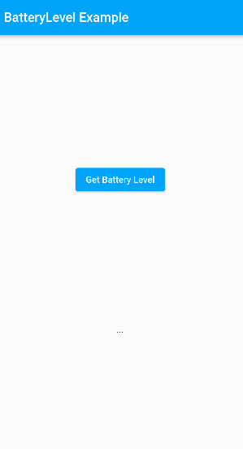
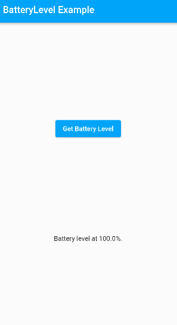
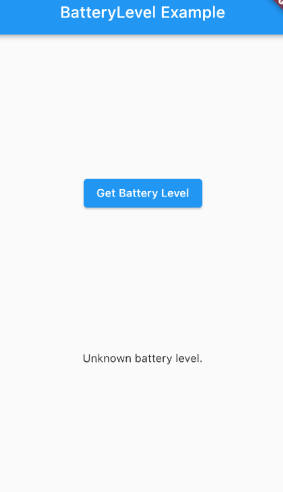

---  
layout: post  
title: Klutter - Battery App
---  

Almost 7 months and 500 commits later a new milestone is reached: Klutter is now available on [pub.dev](https://pub.dev/packages/klutter)!
What better way to celebrate a milestone like then to do a little demo? Let's take Klutter for a test drive and redo the Flutter battery app.

# Intro

If you are already familiar with method channels and using platform specific code in Flutter then skip this section
and just get started with the fun stuff: [tutorial](#Step%201:%20Create%20a%20Klutter%20project).

If you haven't skipped yet then I advise you to have a look in the Flutter [docs](https://docs.flutter.dev/development/platform-integration/platform-channels) 
and go to the section <i>Example: Calling platform-specific iOS and Android code using platform channels</i>.

Here the Flutter team uses an example app, the battery app, to demonstrate how to invoke platform specific code
on iOS and Android using method channels. This process includes writing Dart code on the Flutter side, Java/Kotlin code 
for Android, Swift code for iOS and then glueing it all together. It's good to have this knowledge as context before 
diving into the next tutorial.

# Step 1: Create a Klutter project

Start by creating a new app:

- In a terminal run: **flutter create --org com.example --template=plugin --platforms=android,ios batterylevel**{: style="color: Cyan;" }
- Install the Klutter Framework as dependency:
  - Add klutter: ^0.1.2 to your pubspec.yaml dependencies block.
  - In a terminal run: **flutter pub get**{: style="color: Cyan;" }
- In a terminal run: **flutter pub run klutter:producer init**{: style="color: Cyan;" }

Klutter is now initialized in your plugin project. Let's review the changes Klutter has made.
The following Gradle files should be added to the root folder of your plugin project:
- settings.gradle.kts
- build.gradle.kts
- gradlew
- gradlew.bat
- gradle.wrapper/gradle-wrapper.jar
- gradle.wrapper/gradle-wrapper.properties

These files are required to build the Kotlin Multiplatform module (which we will do in a few minutes).
The most interesting is the build.gradle.kts file. I would like to highlight a few key points here.

First is the dependencies block which adds a few libraries to your JVM classpath:

```kotlin
dependencies {
    classpath("org.jetbrains.kotlin:kotlin-gradle-plugin:1.6.10")
    classpath("com.android.tools.build:gradle:7.0.4")
    classpath("dev.buijs.klutter:core:2022.r6-4.alpha")
    classpath("dev.buijs.klutter.gradle:dev.buijs.klutter.gradle.gradle.plugin:2022.r6-4.alpha")
}
```

In layman's terms this means as much that these libraries are available in the platform module. 
So here we see that our projects Kotlin Multiplatform module will work with:
- Kotlin version 1.6.10
- Android Gradle version 7.0.4
- Klutter Core version 2022.r6-4.alpha
- Klutter Gradle version 2022.r6-4.alpha

Read [here](https://github.com/buijs-dev/klutter) if you want to know more about the Klutter Gradle plugin.

Next in the repositories block the buijs-dev maven repository is added to download the Klutter libraries:

```kotlin
maven { url = uri("https://repsy.io/mvn/buijs-dev/klutter") }
```

And finally there are few Klutter tasks registerd which will be used to build our plugin:

```kotlin
tasks.register("klutterInstallPlatform", Exec::class) {
    commandLine("bash", "./gradlew", "clean", "build", "-p", "platform")
    finalizedBy("klutterCopyAarFile", "klutterCopyFramework")
}

tasks.register("klutterCopyAarFile", Copy::class) {
    from("platform/build/outputs/aar/batterylevel-release.aar")
    into("android/klutter")
    rename { fileName ->
        fileName.replace("batterylevel-release", "platform")
    }
}

tasks.register("klutterCopyFramework", Copy::class) {
    from("platform/build/fat-framework/release")
    into("ios/Klutter")
}
```

# Step 2: Write platform specific code

Go to the platform module in the root folder. The src folder should contain an androidMain, commonMain
and iosMain folder. Inside these folders is some example code. Go ahead and delete them all:
- androidMain/Platform.kt
- commonMain/Greeting.kt
- commonMain/Platform.kt
- iosMain/Platform.kt

Create a new file in commonMain named BatteryLevel. Add the following content:

```kotlin
package com.example.batterylevel.platform

expect class BatteryLevel(context: Any?) {
  val level: Float?
}
```

This class is our platform interface. We have a BatteryLevel class which has a constructor that requires an object which
can be of any type and also might be null. So basically there might or might not be an object and if it's there it could
be anything. Finally we have a class member named level which may or may not return a Float value. We'll see why it's such 
an open defined contract shortly.

Note finally the <b>expect</b> keyword. This keyword is a Kotlin Multiplatform [feature](https://kotlinlang.org/docs/multiplatform-connect-to-apis.html).
It means for this class there should be platform specific implementations in androidMain and commonMain src folders.
Let's create those! 

Create a new file named BatteryLevel in androidMain and add the following content:

```kotlin
package com.example.batterylevel.platform

import android.content.Context
import android.os.BatteryManager

actual class BatteryLevel actual constructor(context: Any?) {

  actual val level: Float? = context?.let {
    getBatteryLevel(context as Context).toFloat()
  }

  private fun getBatteryLevel(context: Context): Int {
    val batteryManager = context.getSystemService(Context.BATTERY_SERVICE) as BatteryManager
    return batteryManager.getIntProperty(BatteryManager.BATTERY_PROPERTY_CAPACITY)
  }

}
```

Create a new file named BatteryLevel in iosMain and add the following content:

```kotlin
package com.example.batterylevel.platform

import platform.UIKit.UIDevice

actual class BatteryLevel actual constructor(context: Any?) {

  actual val level: Float? = UIDevice.currentDevice.batteryLevel.let {
    if(it < 0) null else it * 100
  }

}
```

Just like the <b>expect</b> keyword, <b>actual</b> is a Kotlin Multiplatform feature. The actual classes in iosMain and androidMain
are the implementations of the interface we defined in the commonMain class. With just these few lines we can call platform 
specific code on both Android and iOS! <B>Note</B>: If battery monitoring is disabled on an iOS device, then batteryLevel 
returns -1.0. For the simplicity of this tutorial we're assuming it is enabled but for a production app you'd have to account
for that.

All we need now is to define a service which will be called by Flutter. In commonMain add a new file named Platform. 
Add the following code:

```kotlin
package com.example.batterylevel.platform

import dev.buijs.klutter.annotations.kmp.*

class Platform {

  @KlutterAdaptee(
    name = "getBatteryLevel", 
    requiresAndroidContext = true )
  fun getBatteryLevel(context: Any): Double? {
    return BatteryLevel(context).level?.toDouble()
  }

}
```

A few things happening here. We create an instance of BatteryLevel which is the interface we defined in commonMain.
On runtime this will be either an instance of the BatteryLevel implementation we defined in androidMain on Android devices
or iosMain on iOS devices. 

We also see an annotation: <B>@KlutterAdaptee("getBatteryLevel", requiresAndroidContext = true)</B>. 
This annotation tells Klutter to generate method-channel code for this method and add it to the Flutter library file.
The requiresAndroidContext is an optional value which defaults to false if not present. By setting this value
to true, we let Klutter know to pass in an instance of Context when calling this method  from Android.

Finally we convert the Float to a Double value because Klutter does not support Float values (yet).

# Step 3: Build the Flutter library
- Open a terminal in the root folder and run: **flutter pub run klutter:producer install=platform**{: style="color: Cyan;" }
- In a terminal run: **flutter pub run klutter:producer install=library**{: style="color: Cyan;" } 

These commands do the following steps:
- Build the artifacts for iOS (Framework) and Android (aar).
- Generate dart file in lib.
- Generate method-channel code in root/android.
- Generate method-channel code in root/ios.

Our library is now ready to be used. We will do that shortly, but first for fun and giggles let's see what Klutter has created for us.

Open the root/lib folder and there should be a file named batteylevel.dart. This file should contain the following content:

```dart
import 'dart:async';

import 'package:flutter/services.dart';
import 'package:flutter/widgets.dart';
import 'package:klutter/klutter.dart';

/// Autogenerated by Klutter Framework.
///
/// Do net edit directly, but recommended to store in VCS.
///
/// Adapter class which handles communication with the KMP library.
class Batterylevel {
  static const MethodChannel _channel =
  MethodChannel('com.example.batterylevel');

  static Future<AdapterResponse<double>> getBatteryLevel(
    State caller, {
      void Function(double)? onSuccess,
      void Function(Exception)? onFailure,
      void Function()? onNullValue,
      void Function(AdapterResponse<double>)? onComplete,
    }) async {
    try {
      final json = await _channel.invokeMethod('getBatteryLevel');
      final value = json?.toDouble();
      final AdapterResponse<double> response = AdapterResponse.success(value);

      if (caller.mounted) {
        onComplete?.call(response);
        if (value == null) {
          onNullValue!.call();
        } else {
          onSuccess?.call(value!);
        }
      }

      return response;
    } catch (e) {
      final exception = e is Error ? Exception(e.stackTrace) : e as Exception;

      final AdapterResponse<double> response =
      AdapterResponse.failure(exception);

      if (caller.mounted) {
        onComplete?.call(response);
        onFailure?.call(exception);
      }

      return response;
    }
  }
}

```

This Dart class is the interface we will be using from the Flutter app. We see there's a method-channel created
named <B>com.example.batterylevel</B>. This is the channel that will be used by the Flutter app to communicate 
with the platform. There's a single method named <B>getBatteryLevel</B>. This name is derived from the @KlutterAdaptee
annotation we used before. 

# Step 4: Test the library

In this step we will add a very basic UI to verify the workings of our plugin. Flutter conveniently auto-generates an
example Flutter app which depends on our plugin. Open the pubspec.yaml in your root/example folder and add a dependency
on Klutter. As always run flutter pub get after adding a dependency.

In a terminal run: **flutter pub run klutter:consumer add=batterylevel**{: style="color: Cyan;" }

Open the main.dart file in the example/lib folder. You'll see the batterylevel package is already imported and there's
some basic UI code. This however won't work anymore because we changed our library code. Go ahead and delete everything 
in the _MyAppState class except for the initState method:

```dart

class _MyAppState extends State<MyApp> {

  @override
  void initState() {
    super.initState();
  }

}

```

Add in the UI code:

```dart

class _MyAppState extends State<MyApp> {

  @override
  void initState() {
    super.initState();
  }

  @override
  Widget build(BuildContext context) {
    return MaterialApp(
      home: Scaffold(
        appBar: AppBar(
          title: const Text('BatteryLevel Example'),
        ),
        body: Center(
          child: Column(
            mainAxisAlignment: MainAxisAlignment.spaceEvenly,
            children: [
              ElevatedButton(
                child: const Text('Get Battery Level'),
                onPressed: _getBatteryLevel,
              ),
              Text(_batteryLevel),
            ],
          ),
        ),
      ),
    );
  }
  
}

```

Now we have our view in place and all that's left is actually invoking our Batterylevel library. To do so add a
String variable to hold the batterylevel state:

```dart

  String _batteryLevel = '...';

```

And finally add the getBatteryLevel method:

```dart

Future<void> _getBatteryLevel() async {
  await Batterylevel.getBatteryLevel(this,
    onSuccess: (level) => setState(() {
      _batteryLevel = "Battery level at $level%.";
    }),
    onFailure: (exception) => setState(() {
      _batteryLevel = "Failed to get battery level: $exception.";
    }),
    onNullValue: () => setState(() {
      _batteryLevel = "Unknown battery level.";
    }),
  );
}
  
```

Notice how there is no try-catch block needed to catch PlatformExceptions. This is all handled
by the autogenerated Klutter code. The BatteryLevel library will always return a response. 

We define a few callbacks which will run depending on the response given by the platform call. 
By adding a reference to the current widget to the method call (this), we enable the method
to check if the widget is still mounted. This is done to avoid calling setState just in case 
the widget is already discarded.

To recap this is our final Flutter UI:

```dart

import 'package:flutter/material.dart';
import 'dart:async';

import 'package:batterylevel/batterylevel.dart';

void main() {
  runApp(const MyApp());
}

class MyApp extends StatefulWidget {
  const MyApp({Key? key}) : super(key: key);

  @override
  State<MyApp> createState() => _MyAppState();
}

class _MyAppState extends State<MyApp> {

  @override
  void initState() {
    super.initState();
  }

  String _batteryLevel = '...';

  Future<void> _getBatteryLevel() async {
    await Batterylevel.getBatteryLevel(this,
      onSuccess: (level) => setState(() {
        _batteryLevel = "Battery level at $level%.";
      }),
      onFailure: (exception) => setState(() {
        _batteryLevel = "Failed to get battery level: $exception.";
      }),
      onNullValue: () => setState(() {
        _batteryLevel = "Unknown battery level.";
      }),
    );
  }

  @override
  Widget build(BuildContext context) {
    return MaterialApp(
      home: Scaffold(
        appBar: AppBar(
          title: const Text('BatteryLevel Example'),
        ),
        body: Center(
          child: Column(
            mainAxisAlignment: MainAxisAlignment.spaceEvenly,
            children: [
              ElevatedButton(
                child: const Text('Get Battery Level'),
                onPressed: _getBatteryLevel,
              ),
              Text(_batteryLevel),
            ],
          ),
        ),
      ),
    );
  }

}

```

Open up an Android emulator and run the app. 



Pressing the button should show you the current battery level:



Now do the same in an iOS simulator and if battery monitoring 
is disabled on an iOS device (which is likely is) you should 
see the following:



And that's it. Congratulations on your first Klutter plugin! 

There's a lot more that Klutter can do, like generating full DTO classes in Dart 
based on Kotlin code in platform package. See examples of that in the 
Klutter Gradle [documentation](https://github.com/buijs-dev/klutter).